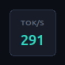

<div align="center">
  
  <h1>OpenCode Vitals</h1>
  <p><strong>Stop guessing how fast your model is. Watch it.</strong></p>
  <p>A tiny always-on-top bar for OpenCode V2 that shows one honest line for the session you are
  working in: turns, steps, and average streaming tokens per second.</p>
  <p>
    
    
    
    
  </p>
</div>

---

## Quick install

**1 — Check your machine first.** It takes ten seconds and tells you whether the bar can run here:

```bash
npx opencode-vitals-selftest
```

**2 — Install it with one command:**

```bash
npx opencode-vitals-install
```

That copies the plugin into the folder OpenCode already looks in, and prints the path it used. It
never touches your configuration file, and it makes no network calls: the package it installs is the
one `npx` just downloaded.

**3 — Restart OpenCode.** The bar is on screen within seconds.

### Other ways to install

Add one line to `opencode.json` or `opencode.jsonc` instead, and OpenCode installs and updates the
package itself:

```jsonc
{
  "$schema": "https://opencode.ai/config.json",
  "plugins": ["opencode-vitals"]
}
```

Or copy the folder to `~/.config/opencode/plugins/opencode-vitals/` and OpenCode finds it with no
command at all. Want to change the history size or turn the bar off? Use the object form in
[Options](#options).

### The install command

```bash
npx opencode-vitals-install              # copy into the plugin directory
npx opencode-vitals-install --link       # symlink instead, while working on the source
npx opencode-vitals-install --status     # what is installed, and which version
npx opencode-vitals-install --uninstall  # remove it again
npx opencode-vitals-install --dir PATH   # use a plugin directory you choose
```

Installing twice updates in place and removes files that a newer release no longer ships. It refuses
to replace a directory that holds a different package unless you pass `--force`, and it will not write
outside the plugin directory. `--uninstall` refuses to remove a folder that does not carry this
package's manifest unless you add `--force` too.

The plugin directory is the one OpenCode itself reads — `$XDG_CONFIG_HOME/opencode/plugins`, or
`~/.config/opencode/plugins` when that variable is unset — **on every platform, Windows included**
(verified against the shipped CLI, which computes the same path). The path used is printed, so a
different setup is visible rather than silent.

**Do not run `npm install opencode-vitals`.** OpenCode resolves and installs npm plugins itself at
startup — on this machine each package lands in
`~/.cache/opencode/npm/opencode-vitals@latest/<timestamp>/`. A copy you install into a project's
`node_modules` is not what gets loaded, so it only leaves a second, stale copy on your disk. The
config line is the whole install.

---

## Why

You can feel that a session got slower. You cannot see it.

Every dashboard OpenCode ships answers a different question — cost, token count, context size — and
none of them answer the one you actually have while you work: **is this session fast, and is it
getting slower?** Model output arrives in a stream, so the number that matters is throughput while
the model is generating, not the wall-clock time of a turn that also ran a build, a test, and three
tool calls.

OpenCode Vitals puts that number on your screen, in the corner, all session long.

## What you get

```
◔  19 turns   65 steps   282 tok/s
```

- **Always on top, never in the way.** 360×54 pixels, undecorated, no taskbar entry, no focus
  steal. Drag it anywhere; the position is remembered. Click the close button and it collapses to a
  small square that keeps showing tok/s; click the square to bring it back.
- **A dial, not a dot.** The gauge is a real speedometer: a 270° track, five ticks, a needle on the
  session's tok/s, and a soft teal glow that only appears when there is a measurement. Numbers are
  drawn bright with their units dimmed, and tok/s carries the accent colour, so the eye lands on the
  number you actually came for.
- **Session-wide, not last-message.** The three numbers aggregate the whole session you are looking
  at, so a single fast reply cannot flatter a slow session.
- **It follows your tab.** Switch sessions in the Desktop app and the bar switches with it.
- **It leaves when you do.** Close OpenCode and the bar goes with it; nothing is left on screen.
- **It tells you when it updated.** A new version announces itself once, in place of the numbers.
- **You can check what is running.** `npx opencode-vitals-selftest` prints the loaded version, the
  previous one, and every fact the bar depends on.

<p align="center">
  
</p>

## The numbers, exactly

No estimates, no invented numbers. Every value is read from OpenCode's own event stream.

| Number | What it is |
| --- | --- |
| **turns** | Responses completed in this session. |
| **steps** | Model steps across those responses, so a response that called tools five times is not mistaken for a fast one. |
| **tok/s** | `generated tokens ÷ active stream time`, where generated tokens are output plus reasoning tokens, and active stream time is the time the model was actually streaming. Tool executions between steps stay **out** of the denominator. |

Deliberately excluded, because including them would flatter the number:

- **Compaction executions** and synthetic inbox items — they are not your work.
- **Duplicate completions, late deltas, and repeated plugin instances** — deduplicated by event and
  response identity, so a reconnect cannot inflate a session.
- **Wall-clock turn time** — it mixes model thinking with your tools.

If the provider reports no token counts, `tok/s` shows `–` instead of guessing. Per-turn detail
(`firstTokenMs`, `firstTextMs`, `firstCharMs`, `totalMs`, `activeStreamMs`, per-model and per-agent
token counts) stays in the plugin's own storage, capped at 100 records, if you want to compute
something else.

## Install

OpenCode installs npm plugins itself with Bun at startup, so installing is one config entry and a
restart.

### From npm, with options

```jsonc
// opencode.json or opencode.jsonc
{
  "$schema": "https://opencode.ai/config.json",
  "plugins": [
    {
      "package": "opencode-vitals",
      "options": {
        "popup": true
      }
    }
  ]
}
```

### From npm, defaults only

```jsonc
{
  "$schema": "https://opencode.ai/config.json",
  "plugins": ["opencode-vitals"]
}
```

Restart OpenCode and the bar is there within seconds.

### By copying the folder

Files in the plugin directory are loaded automatically, with no configuration at all:

```bash
mkdir -p ~/.config/opencode/plugins
cp -r opencode-vitals ~/.config/opencode/plugins/opencode-vitals
```

### From source, while you work on it

```bash
git clone https://github.com/moutazideal/opencode-vitals.git
ln -s "$PWD/opencode-vitals" ~/.config/opencode/plugins/opencode-vitals
```

Edits reach the running plugin within five seconds — no restart. Keep the link under the folder name
OpenCode already discovered, or the running instance will be left pointing at nothing.

## Requirements

| | |
| --- | --- |
| OpenCode | V2 (developed against 2.0.14 and 2.0.16) |
| Node | 18 or newer, for the plugin |
| Python | 3.9+ **with tkinter**, for the bar |
| Packages to install | **none** |

tkinter ships with the official Python installers on Windows and macOS. On Debian/Ubuntu it is the
small `python3-tk` package, usually already present on a desktop machine. On a headless server
(SSH, CI, container) the bar is skipped and measurement still runs.

## Platform support

Being straight about this, because "works everywhere" is usually a claim nobody checked:

| | Linux | macOS | Windows |
| --- | --- | --- | --- |
| Measurement core | **tested** | same code, no OS calls | same code, no OS calls |
| Bar window | **tested** — GNOME/Mutter on X11: undecorated managed window, `_NET_WM_STATE_ABOVE`, drag, collapse, saved position | expected — Tk undecorated + topmost; best-effort against fullscreen apps | expected — Tk undecorated + topmost |
| Follows the open tab | **tested** — `~/.config/ai.opencode.desktop/drafts.sqlite` | `~/Library/Application Support/…` (Electron convention) | `%APPDATA%\…` (Electron convention) |
| Leaves with the app | **tested** — `/proc` scan | `pgrep` per name | `tasklist` per name |

**Only the Linux column has run on real hardware.** The macOS and Windows paths are ordinary
platform code with one rule that matters: when a check cannot run, the bar stays instead of
disappearing. Run the selftest on your machine and you will know in ten seconds.

## Does it work here? Ask the plugin

```bash
npx opencode-vitals-selftest    # after installing from npm
npm exec -- opencode-vitals-selftest   # exactly the same thing, spelled out
node selftest.mjs               # from a clone
python3 selftest.py             # with Python directly
```

```
opencode-vitals selftest — Linux 7.0.0-34-generic (linux)
python 3.12.3 at /usr/bin/python3

ok   tkinter available
ok   Tk runtime present — Tk 8.6, Tcl 8.6
ok   a window system is reachable — DISPLAY=:0
ok   a preferred font exists — Ubuntu
ok   topmost window accepted — type=toolbar, topmost=1
ok   window transparency accepted — -alpha 0.96
ok   undecorated window type chosen — toolbar
ok   Desktop state database found — /home/you/.config/ai.opencode.desktop/drafts.sqlite
ok   open tab read from the database — ses_example0000000000000001
ok   plugin installed on disk — /home/you/.config/opencode/plugins/opencode-vitals
ok   plugin status file present — /tmp/opencode-latency-monitor/latest.json
ok   session totals readable — 2 session(s)
ok   a bar instance is running — pid 12345
ok   plugin version recorded — running 0.1.1, package 0.1.1

13/13 required checks passed, plus 1 note

Ready: the bar is running on this machine.
```

Every line is a measured fact, not an assumption. Only the checks of what this machine can do are
required; runtime facts are reported as notes, so a plugin that is not installed yet is never
reported as an untrustworthy machine — the command says so and points at the install command. A
report from another operating system is worth sending with a bug.

## Options

| Option | Default | What it does |
| --- | --- | --- |
| `popup` | `true` | Show the bar. `false` keeps measuring with no window. |
| `historyLimit` | `20` | Measurements kept in storage, 1–100. |
| `log` | `true` | Log one line per measurement through OpenCode's logger. |
| `enabled` | `true` | Master switch. |

```json
{
  "plugins": [
    {
      "package": "opencode-vitals",
      "options": { "historyLimit": 50, "log": true, "popup": true, "enabled": true }
    }
  ]
}
```

Environment variables, for the curious: `OPENCODE_LATENCY_PYTHON` (interpreter),
`OPENCODE_LATENCY_POSITION` (`top-right`, `top-left`, `bottom-right`, `bottom-left`),
`OPENCODE_LATENCY_DESKTOP_DB` (where the app keeps its state database).

## Privacy

This plugin has no network code at all. No registry calls, no analytics, no telemetry, no update
pings. It reads OpenCode's own event stream and writes a handful of small JSON files under your
system temporary directory.

- **Prompts and responses are never stored.** Only counts, timings, model and agent names, and
  session/message identifiers.
- **One deliberate exception, and you can switch it off by moving the file:** to know which tab you
  are looking at, the bar reads a single row (`tabs.recent`) from the Desktop app's own state
  database, opened **read-only**. No draft text is read. Point `OPENCODE_LATENCY_DESKTOP_DB`
  somewhere else, or let the file disappear, and the bar falls back to "the session you last typed
  in".
- **Nothing survives a restart except the numbers.** The status directory is plain files in
  `/tmp`-style temporary storage, and stale response markers are swept on a timer rather than
  waiting for your next message.

## Updating

How you update depends on how you installed it.

| How you installed it | How to update |
| --- | --- |
| `npx opencode-vitals-install` | Run the same command again. It updates in place. |
| `npx opencode-vitals-install --link` | `git pull` in the checkout; the link picks it up. |
| `"plugins": ["opencode-vitals"]` | OpenCode owns the copy: it resolves the package at startup into `~/.cache/opencode/npm/opencode-vitals@latest/<timestamp>/`. Quit and reopen OpenCode after a new version is published, then check the version below. |
| Copied the folder | Replace the files with the new release. The running plugin picks them up within about five seconds. |

```bash
npm view opencode-vitals version                              # what is published now
ls -d ~/.cache/opencode/npm/opencode-vitals@latest/* 2>/dev/null  # what OpenCode holds
```

OpenCode has its own `update` setting — `"update": "notify" | "auto" | "disable"`, defaulting to
`notify` — and its documentation states that an automatic install does **not** restart a running
server, so something has to restart for a new copy to take effect. Whether that setting also covers
plugins is not something this project has verified.

### Check what is actually running

Do not assume an update landed. The selftest prints the loaded version, and the bar says so out loud:

```bash
npx opencode-vitals-selftest
```

```
ok   plugin version recorded — running 0.1.1, package 0.1.1
```

If it still reports the old version, OpenCode reused its cached snapshot. That is the normal case
after a plain restart: each package keeps a single `<timestamp>` directory in the cache, and on this
machine several application restarts produced no second snapshot, so a restart alone is not proof of
a refresh. Quit OpenCode, and if the version still has not moved, stop the leftover sidecar process
— the `opencode-cli serve --service` process — and launch OpenCode again, then run the selftest once
more. On Linux that service is supervised by systemd and can outlive the app window, which is why
reopening the window is not always enough.

### How the plugin announces a new copy

When the module is evaluated it compares its own `package.json` version with the one it recorded in
`plugin-version.json`, with no network call involved:

- the bar shows `0.2.0 installed` for eight seconds, exactly once — even if the update landed while
  OpenCode was closed;
- the plugin log reads `updated 0.1.1 -> 0.2.0`;
- the selftest prints `running <new>, package <new>` and the previous version when there was one.

## Development

```bash
npm test           # 156 plugin checks + 54 bar checks
npm run selftest   # does the bar work on this machine?
npm pack           # build the publishable tarball
npm run prepublishOnly   # what publish runs first
```

```
opencode-vitals/
├── index.js            the plugin: events, accounting, storage
├── bar.py              the bar: Tkinter, standard library only
├── install.mjs         npx opencode-vitals-install
├── selftest.mjs        launcher that finds a Python with tkinter
├── selftest.py         per-machine diagnosis
├── start-bar.sh        run the bar by hand
└── tests/
    ├── vitals.test.mjs plugin logic
    └── bar.test.py     bar behaviour, lock, Desktop tab tracking
```

The test suite includes the mistakes worth catching twice: zombie holders in the singleton lock, a
session with no totals yet (which must fall back to the last measurement instead of claiming zero
work), a WAL write that leaves the database timestamp untouched, and process checks on macOS and
Windows driven by a fake process list so their logic is verified even though their hardware was
not.

## License

MIT. See [LICENSE](LICENSE).
